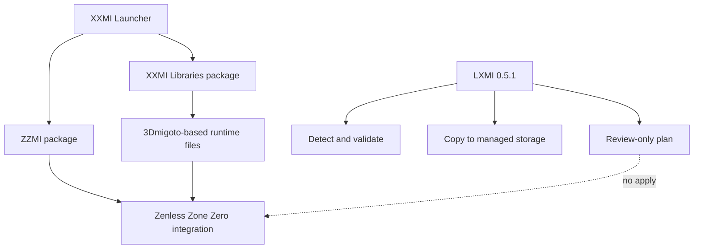

# Investigación del ecosistema XXMI y ZZMI

**Revisión:** 2026-09-28
**Estado:** contraste de fuentes upstream y del host; no es una prueba de compatibilidad de ejecución.

## Responsabilidades

| Componente | Responsabilidad observada |
|---|---|
| XXMI Launcher | Administra los model importers, sus paquetes y el flujo de carga. La configuración upstream específica de ZZMI declara `requirements=['XXMI']` y `installation_path='ZZMI/'`. |
| XXMI Libraries | Paquete aparte de bibliotecas basadas en el fork de 3Dmigoto. ZZMI lo consume; el paquete ZZMI por sí solo no aporta todas las DLL requeridas. |
| ZZMI | Importer y configuración propios de Zenless Zone Zero; declara ejecutables `ZenlessZoneZero.exe` y `ZenlessZoneZeroBeta.exe`, carpeta `ZenlessZoneZero Game` y carpeta de datos `ZenlessZoneZero_Data`. |
| LXMI | En 0.5.1 detecta el juego, valida de forma estructural una carpeta ZZMI local, registra su copia en almacenamiento controlado y genera un plan revisable. No ejecuta ni despliega archivos al juego. |

La configuración de ZZMI del launcher y el archivo `d3dx.ini` upstream identifican el ejecutable de destino, la raíz `ZZMI/`, la inclusión de `Core/ZZMI/main.ini`, la dependencia `XXMI` y que el paquete publicado no incluye las DLL requeridas de 3Dmigoto. [Configuración ZZMI del launcher](https://github.com/SpectrumQT/XXMI-Launcher/blob/main/src/xxmi_launcher/core/packages/model_importers/zzmi_package.py), [d3dx.ini upstream](https://github.com/leotorrez/ZZMI-Package/blob/main/ZZMI/d3dx.ini)

## Layout y versionado contrastados

La vista upstream revisada presenta el paquete bajo `ZZMI/`, con `d3dx.ini` y recursos bajo `Core/ZZMI/`. El `main.ini` upstream incluye `Libraries/Includes.ini`, `d3dx_patch.ini` y `help.ini`; declara `global $version = 1.50` y el aviso visible `ZZMI 1.5.0`. La implementación del launcher obtiene la versión leyendo `Core/ZZMI/main.ini` con su parser de versión. LXMI conserva el valor raw como evidencia y no lo equipara a una etiqueta autenticada. [main.ini upstream](https://github.com/leotorrez/ZZMI-Package/blob/main/ZZMI/Core/ZZMI/main.ini)

La release más reciente visible al revisar el repositorio era **v1.5.0 (2026-09-22)**. El repositorio avisa que el paquete no está destinado al uso general e indica utilizar el instalador oficial. LXMI no descarga ni importa automáticamente esa release. [Releases de ZZMI-Package](https://github.com/leotorrez/ZZMI-Package/releases)

El contrato estructural acotado que LXMI 0.5.1 comprueba requiere:

| Ruta relativa al payload ZZMI | Evidencia / validación |
|---|---|
| `d3dx.ini` | Target de ZZZ conocido y include de `Core/ZZMI/main.ini` |
| `Core/ZZMI/main.ini` | Núcleo y ubicación del valor raw `$version` |
| `Core/ZZMI/d3dx_patch.ini` | Include upstream desde `main.ini` |
| `Core/ZZMI/help.ini` | Include upstream desde `main.ini` |
| `Core/ZZMI/Libraries/Includes.ini` | Include upstream desde `main.ini` |

Este es un conjunto mínimo de anclas estructurales elegido por LXMI a partir del árbol actual, no un inventario exhaustivo de todos los archivos de una release ni prueba de que el payload esté intacto/auténtico. El importador acepta la carpeta de payload extraída, no una release comprimida. Para un package real todavía se debe contrastar la lista con una release descargada por el usuario antes de considerarla suficiente.

## Dependencia y relación con el runtime

`XXMI Libraries` es un paquete separado. La configuración upstream de ZZMI declara la dependencia `XXMI`; por eso LXMI no clasifica ZZMI como autosuficiente. El plan requiere los dos paquetes administrados para considerar que el conjunto puede planificarse. Las bibliotecas se mantienen como artefacto y paquete diferentes en el storage de LXMI. [Package config de ZZMI](https://github.com/SpectrumQT/XXMI-Launcher/blob/main/src/xxmi_launcher/core/packages/model_importers/zzmi_package.py), [repositorio XXMI-Libs-Package](https://github.com/SpectrumQT/XXMI-Libs-Package)

La inspección estructural del paquete y la presencia local de Proton no demuestran que el runtime funcione con ZZZ, que Steam elija una versión concreta, ni que el juego acepte la integración.

## Distribución, Steam y Linux/Proton

El issue de XXMI Launcher sobre soporte de la edición Steam de ZZZ y, como petición adicional, Proton/Linux seguía abierto al revisar el 2026-09-28. Esto es evidencia de que el soporte específico seguía sin confirmarse en esa fuente; no demuestra por sí solo que toda combinación sea imposible. LXMI mantiene los estados separados: juego conocido por ZZMI, distribución detectada, soporte Steam sin verificar y compatibilidad Linux/Proton sin verificar. [Solicitud upstream #318](https://github.com/SpectrumQT/XXMI-Launcher/issues/318)

La tienda oficial de Steam lista ZZZ con AppID `4162040`; en este host el manifest local confirma independientemente ese AppID. Ninguna de esas evidencias prueba compatibilidad de ZZMI con la edición Steam o Linux. [Ficha oficial de ZZZ en Steam](https://store.steampowered.com/app/4162040/Zenless_Zone_Zero/)

## Firma, hashes y autenticidad

La configuración del launcher ZZMI incluye una expresión para leer una firma de release y una clave pública ECDSA. El código de XXMI Launcher tiene verificación de firma propia para componentes administrados. LXMI 0.5.1 **no** implementa esa verificación y no debe reutilizar la clave ni improvisar un algoritmo. El SHA-256 que LXMI guarda sirve para detectar cambios en la copia local después de importarla; no acredita autoría, release oficial ni autenticidad.

El repositorio `ZZMI-Package` declara **GPL-3.0** a nivel de repositorio. El launcher upstream también publica una licencia GPL-3.0. XXMI Libraries incluye material de 3Dmigoto y carpetas/dependencias con avisos propios; el análisis de licencias de cada binario, recurso y dependencia no está completo. LXMI no redistribuye esos paquetes. Esta observación no es asesoría legal ni una autorización de redistribución. [Licencia de ZZMI-Package](https://github.com/leotorrez/ZZMI-Package/blob/main/LICENSE), [licencia de XXMI Launcher](https://github.com/SpectrumQT/XXMI-Launcher/blob/main/LICENSE), [licencias y contenido de XXMI Libraries](https://github.com/SpectrumQT/XXMI-Libs-Package)

## Estado LXMI 0.5.1

| Propiedad | Estado |
|---|---|
| Registro Steam ZZZ | COMPROBADO por fixture y manifest local |
| AppID en host | COMPROBADO: `4162040` |
| Ejecutable esperado en host | COMPROBADO: `ZenlessZoneZero.exe` encontrado bajo `games/ZenlessZoneZero Game/` |
| `compatdata/4162040/pfx` | COMPROBADO como candidato en el host; salud/runtime activo no evaluados |
| Layout mínimo ZZMI | UPSTREAM VERIFIED en la rama `main` observada el 2026-09-28; no fijado a commit |
| Import de package ZZMI real | NO COMPROBADO; no se descargó/importó release real en este incremento |
| XXMI Libraries real en el storage | No se afirma disponible; los tests usan FIXTURE |
| Selección de Proton por Steam | NO COMPROBADO; LXMI mantiene `unknown` |
| ZZMI + Steam | NO COMPROBADO; el issue upstream consultado seguía abierto |
| ZZMI + Linux/Proton | NO COMPROBADO |
| Apply / DLL / settings / prefix | Fuera de alcance; no implementado ni ejecutado |

Próxima investigación: fijar commit/tag del contrato de paquetes; revisar avisos por archivo antes de redistribuir; verificar compatibilidad del host y de la distribución con un procedimiento autorizado antes de permitir una instalación real. No evadir anti-cheat o controles del juego.
