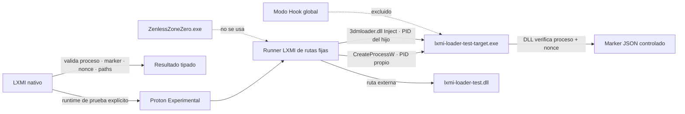

# LXMI 0.7 — investigación del loader upstream

**Consultado y probado:** 2026-09-28. Los enlaces a código se fijan a commits; las release notes se vinculan al tag.

## Fuentes fijadas

| Repositorio | Referencia | Archivos/evidencia |
|---|---|---|
| `SpectrumQT/XXMI-Launcher` | tag `v2.2.1`, commit `d56786b8dacb00c35204bff45ff5b8b83bd8962a` | [`zzmi_package.py`](https://github.com/SpectrumQT/XXMI-Launcher/blob/d56786b8dacb00c35204bff45ff5b8b83bd8962a/src/xxmi_launcher/core/packages/model_importers/zzmi_package.py), [`migoto_package.py`](https://github.com/SpectrumQT/XXMI-Launcher/blob/d56786b8dacb00c35204bff45ff5b8b83bd8962a/src/xxmi_launcher/core/packages/migoto_package.py), [`dll_injector.py`](https://github.com/SpectrumQT/XXMI-Launcher/blob/d56786b8dacb00c35204bff45ff5b8b83bd8962a/src/xxmi_launcher/core/utils/dll_injector.py) |
| `SpectrumQT/XXMI-Launcher` | tag `v2.1.5`, release commit corto `abc8087` mostrado por GitHub | [notas oficiales de v2.1.5](https://github.com/SpectrumQT/XXMI-Launcher/releases/tag/v2.1.5) |
| `SpectrumQT/XXMI-Libs-Package` | tag `v1.1.7`, commit `6bf6a746a198c82fb34dbd336cac7ad8e0f4ddc9`, release id `387957029` | [source tree](https://github.com/SpectrumQT/XXMI-Libs-Package/tree/6bf6a746a198c82fb34dbd336cac7ad8e0f4ddc9), [`COPYING.txt`](https://github.com/SpectrumQT/XXMI-Libs-Package/blob/6bf6a746a198c82fb34dbd336cac7ad8e0f4ddc9/COPYING.txt) |

Las releases consultadas y el asset/component signature se revalidaron mediante el package store de LXMI. El test no descarga desde GitHub ni modifica el package original; toma el `3dmloader.dll` cuyo hash está registrado en ese package verificado.

## Ruta upstream relevante para ZZMI

En el código fijado, `ZZMIConfig` hereda `use_hook = true` de `StartAndInject`. El `MigotoInjector` pasa `3dmloader.dll` a `DllInjector`; con Hook llama a `HookLibrary`/`UnhookLibrary` y al flujo que instala el hook global antes de iniciar el proceso. La alternativa con `use_hook = false` recorre el camino directo y llama al export `Inject` con el PID del proceso objetivo y las DLL declaradas. Los comentarios adyacentes a las ramas en `migoto_package.py` describen esos métodos al revés respecto de las funciones llamadas; la conclusión aquí se deriva de las llamadas y del código de `dll_injector.py`, no de esos comentarios.

**Resultado para ZZMI:** la ruta upstream por defecto observada es **Hook** a través de `3dmloader.dll`; no se observó que ZZMI elija `3dmloader.exe` como su default. En v2.1.5 las notas indican que se sustituyó `pyinjector` por un injector propio en `3dmloader.exe` para el modo Direct Inject basado en `WriteProcessMemory` (default de EFMI según esas notas). Esto es evidencia de una implementación/versión concreta, no prueba de que toda integración ZZMI use ese ejecutable. La revisión del código v2.2.1 muestra a `DllInjector` cargando `3dmloader.dll` y resolviendo su export `Inject`; no se ejecutó `3dmloader.exe` en LXMI.

El experimento 0.7 eligió **Direct Inject** exclusivamente para una prueba controlada, invocando `Inject` del componente upstream `3dmloader.dll` contra el PID devuelto por el `CreateProcessW` que creó el único `lxmi-loader-test-target.exe`. No enumeró procesos ni aceptó PID, nombre, target o DLL desde React. El modo Hook se excluyó porque su instalación es global y excede el alcance de una prueba aislada.

Esto **no es el modo predeterminado ZZMI**, no prueba su configuración `[Loader]`, ni establece compatibilidad de ZZMI/ZZZ/Steam/Linux/Proton.

## Componentes y licencia

- El package XXMI Libraries v1.1.7 está separado del package ZZMI y aporta `3dmloader.dll`; LXMI verificó la firma upstream del componente y el hash antes de copiarlo al storage privado `tests/loader-v1/`.
- El repositorio de XXMI Libraries declara GPLv3 en `COPYING.txt`. La revisión del binario permite este uso de prueba local dentro del entorno del usuario; LXMI **no redistribuye** `3dmloader.dll` en Git ni en sus artefactos. La categoría interna queda `VerifiedExecutableOnly`; no equivale a autorización de redistribución.
- La release v2.1.5 y su nota sobre `3dmloader.exe` no se usaron como procedencia del componente probado. No se copió ni ejecutó `3dmloader.exe` o el launcher portable.
- No se copió código fuente upstream. La DLL y la integración de prueba permanecen fuera del repositorio, bajo `$XDG_DATA_HOME/lxmi/tests/loader-v1/`.

## Capacidades, alcance y límites

| Capacidad | Resultado de 0.7 |
|---|---|
| Ejecutar un helper/test target Windows bajo el Proton de prueba explícito | **HOST TEST — comprobado** |
| Cargar el test DLL externo con el export Direct Inject de `3dmloader.dll` | **HOST TEST — comprobado** para el target fijo LXMI |
| Mapping Linux→Windows de target y DLL remotos | **HOST TEST — comprobado** por mapping del prefix y paths devueltos por el marker |
| Rechazar un target fijo ausente sin fallback | **HOST TEST — comprobado**, exit `10` |
| Rechazar DLL ausente y nonce incorrecto | **HOST TEST — comprobado**, exits `11` y `12` |
| Modo Hook global | **No probado / fuera del experimento** |
| `3dmloader.exe` | **No probado** |
| Default Hook de ZZMI, config de `d3dx.ini` o identity `XXMI Launcher.exe` | **No probado** |
| Lanzamiento/carga en `ZenlessZoneZero.exe` o interacción anti-cheat | **No probado y prohibido en 0.7** |
| Compatibilidad ZZMI + ZZZ Steam + Linux/Proton | **Desconocida** |

El test usa el prefix aislado de LXMI `test-prefixes/loader-v1/compatdata`; no usa `compatdata/4162040`. La relación de prefix requerida por ZZZ sigue **UNKNOWN**. No se cambia Steam, juego, prefix de juego ni selección de Proton del planner.

## Diagrama del laboratorio

## Fuentes

- [Release XXMI Launcher v2.1.5](https://github.com/SpectrumQT/XXMI-Launcher/releases/tag/v2.1.5)
- [ZZMI package, launcher v2.2.1 fijado](https://github.com/SpectrumQT/XXMI-Launcher/blob/d56786b8dacb00c35204bff45ff5b8b83bd8962a/src/xxmi_launcher/core/packages/model_importers/zzmi_package.py)
- [Migoto orchestration, launcher v2.2.1 fijado](https://github.com/SpectrumQT/XXMI-Launcher/blob/d56786b8dacb00c35204bff45ff5b8b83bd8962a/src/xxmi_launcher/core/packages/migoto_package.py)
- [DllInjector API/orchestration, launcher v2.2.1 fijado](https://github.com/SpectrumQT/XXMI-Launcher/blob/d56786b8dacb00c35204bff45ff5b8b83bd8962a/src/xxmi_launcher/core/utils/dll_injector.py)
- [XXMI Libraries v1.1.7 fijado](https://github.com/SpectrumQT/XXMI-Libs-Package/tree/6bf6a746a198c82fb34dbd336cac7ad8e0f4ddc9)
- [Verificación y resultados del host LXMI 0.7](../06_Verificacion/verificacion_0_7.md)
