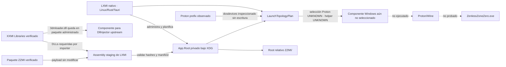

# Topología del runtime XXMI en Linux — LXMI 0.5.3

**Consultado:** 2026-09-28
**Código upstream fijado:** `SpectrumQT/XXMI-Launcher`, release `v2.2.1`, commit `d56786b8dacb00c35204bff45ff5b8b83bd8962a`.

Este documento separa las responsabilidades observadas en el launcher y los paquetes. La existencia de los archivos no demuestra que ZZMI funcione con ZZZ Steam bajo Proton.

## Qué establece upstream

| Componente | Responsabilidad observada | Evidencia fijada |
|---|---|---|
| XXMI Launcher | Administra selección de juego/importer, resuelve rutas, actualiza configuración y dirige el arranque/carga desde el entorno Windows del launcher. | [`model_importer.py`](https://github.com/SpectrumQT/XXMI-Launcher/blob/d56786b8dacb00c35204bff45ff5b8b83bd8962a/src/xxmi_launcher/core/packages/model_importers/model_importer.py), [`zzmi_package.py`](https://github.com/SpectrumQT/XXMI-Launcher/blob/d56786b8dacb00c35204bff45ff5b8b83bd8962a/src/xxmi_launcher/core/packages/model_importers/zzmi_package.py) |
| `App.Root` | Root que el launcher asigna a su aplicación. Si `importer_path` es relativo, upstream lo resuelve como `App.Root / importer_path`. | `ModelImporterConfig.importer_path` en [`model_importer.py`](https://github.com/SpectrumQT/XXMI-Launcher/blob/d56786b8dacb00c35204bff45ff5b8b83bd8962a/src/xxmi_launcher/core/packages/model_importers/model_importer.py) |
| ZZMI importer | Integración del juego ZZZ. El launcher fija `importer_folder = "ZZMI/"`; ese importer no es el directorio del juego. | [`zzmi_package.py`](https://github.com/SpectrumQT/XXMI-Launcher/blob/d56786b8dacb00c35204bff45ff5b8b83bd8962a/src/xxmi_launcher/core/packages/model_importers/zzmi_package.py) |
| `d3dx.ini` | Configuración de 3Dmigoto. ZZMI declara `target = ZenlessZoneZero.exe` y `loader = XXMI Launcher.exe`, además de incluir `Core/ZZMI/main.ini`. | [`ZZMI-Package` v1.5.0, commit `e59f87047cd405c5db5476d3b1b499574bc43d67`](https://github.com/leotorrez/ZZMI-Package/tree/e59f87047cd405c5db5476d3b1b499574bc43d67) y el paquete oficial autenticado localmente en 0.5.2 |
| `Loader.loader` | Nombre de proceso permitido por la configuración Loader de 3Dmigoto; no es una orden para que el proceso Linux LXMI se renombre ni se convierta en un ejecutable Windows. | [`d3dx.ini` de 3Dmigoto](https://github.com/bo3b/3Dmigoto/blob/master/Dependencies/d3dx.ini), sección `[Loader]` |
| XXMI Libraries | Paquete separado que provee componentes de 3Dmigoto. El código fijado pasa `3dmloader.dll` al `DllInjector`; el despliegue del paquete coloca `d3d11.dll` y `d3dcompiler_47.dll` en el importer. | [`migoto_package.py`](https://github.com/SpectrumQT/XXMI-Launcher/blob/d56786b8dacb00c35204bff45ff5b8b83bd8962a/src/xxmi_launcher/core/packages/migoto_package.py) |
| `3dmloader.exe` | Las notas de una versión upstream describen un ejecutable asociado a un camino de inyección directa. No equivale a `3dmloader.dll` y no se considera requisito universal del runtime actual. | [Notas de XXMI Launcher v2.1.5](https://github.com/SpectrumQT/XXMI-Launcher/releases/tag/v2.1.5); contrastadas con el código fijado del paquete Migoto |
| XXMI Launcher Portable para Linux | Upstream documenta su ejecución mediante Wine 9.22+ y requisito de Microsoft Visual C++ Redistributable. Esto describe el launcher portable, no demuestra ZZZ Steam + Proton + inyección. | [Opciones de inicio upstream](https://github.com/SpectrumQT/XXMI-Launcher/wiki/More-Start-Options) |

La comprobación upstream de que el launcher/importer está fuera del directorio del juego corresponde a la configuración Windows nativa; el código de ruta omite esa validación bajo Wine. LXMI adopta una ubicación fuera del juego y del prefix por diseño y por ownership, no afirma que ese chequeo se ejecute igual bajo Wine.

La wiki upstream documenta **Native Steam Launch** para ZZZ y describe **Direct Steam Launch** como pendiente. Ninguna de esas referencias valida la combinación Steam nativo de Linux, Proton y ZZMI.

## Licencia y redistribución

- XXMI Launcher declara GPL-3.0; XXMI Libraries publica licencia GPL-3.0 en su repositorio.
- Las licencias y titularidad de cada binario/componente distribuible deben revisarse individualmente. Que el repositorio sea público no autoriza por sí solo a LXMI a redistribuir sus artefactos.
- LXMI no copia código upstream al repositorio ni redistribuye binarios del launcher/helper. Los paquetes oficiales se conservan en storage privado del usuario tras verificar su provenance.
- SHA-256 en LXMI detecta cambios de una copia frente al inventario local. La firma upstream respalda procedencia respecto de la clave fijada. Ninguno de los dos prueba seguridad al ejecutar o compatibilidad.

## Topología modelada por LXMI



## Managed importer root de LXMI

LXMI materializa una combinación versionada bajo:

```text
$XDG_DATA_HOME/lxmi/runtimes/zenless-zone-zero/zzmi/<runtime-id>/
```

`App.Root` es el directorio `<runtime-id>` y el importer es su subdirectorio `ZZMI/`. El manifest `runtime-manifest.json` queda al lado del importer, fuera del payload upstream. LXMI crea `Mods/` solo bajo esa raíz administrada. Los packages fuente permanecen inmutables bajo `packages/xxmi/<digest>`.

En el importer ensamblado se copian los archivos ZZMI y las dos DLL que el código upstream despliega dentro de `importer_path`. `d3dx.ini` se deriva en staging, cambiando solo `[Loader] target` al nombre del ejecutable real registrado para ZZZ. Se preserva `[Loader] loader = XXMI Launcher.exe`; LXMI no tiene evidencia para reemplazar esa identidad.

`3dmloader.dll` se mantiene en su paquete XXMI Libraries y el manifest de runtime registra su ruta y hash. No se implementa un Windows helper que lo consuma.

## Unknowns que bloquean una decisión de lanzamiento

| Pregunta | Estado |
|---|---|
| Qué proceso Windows debe presentar la identidad allowlisted del loader | **UNKNOWN** |
| Si el helper y el juego requieren el mismo prefix | **UNKNOWN** |
| Qué estrategia upstream es segura/reutilizable con ZZZ Steam + Proton | **UNKNOWN** |
| Si ZZZ Steam + Linux/Proton + ZZMI inyecta y carga correctamente | **NO COMPROBADO** |
| Qué Proton seleccionará Steam para ZZZ | **UNKNOWN** |
| Licencia de redistribución de cada binario | Revisión individual pendiente; LXMI no redistribuye |

LXMI no lanza procesos, no inyecta DLL, no modifica anti-cheat/DRM ni altera Steam, ZZZ, compatdata o prefix.
