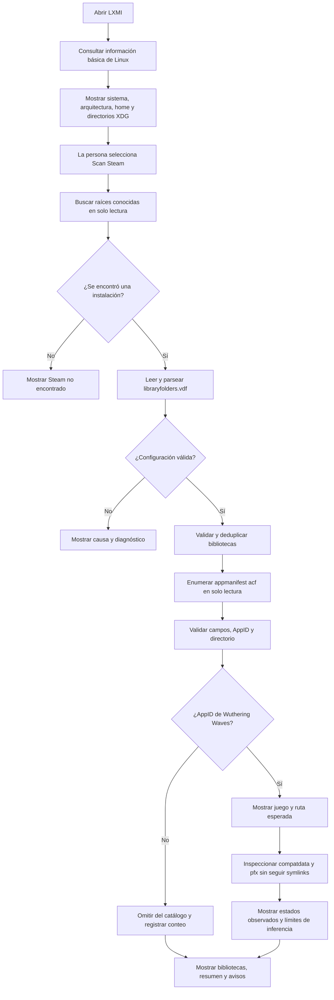
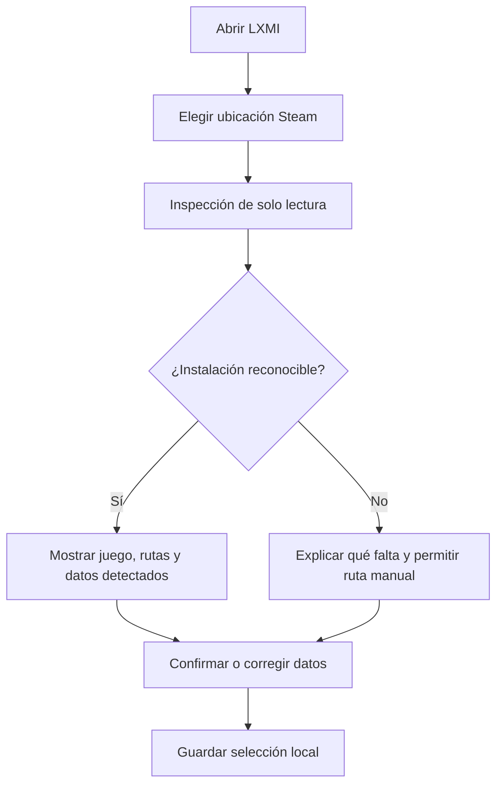
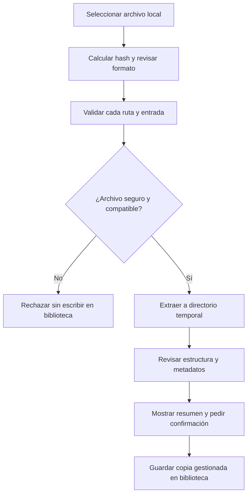
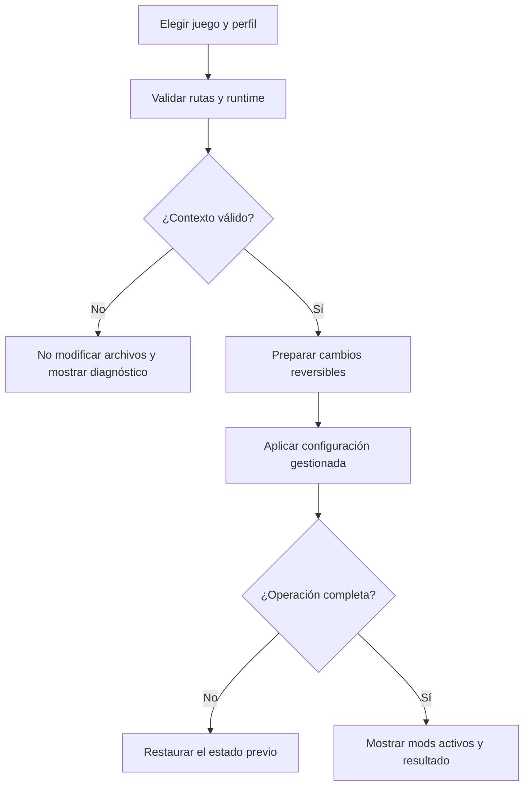

# Flujos de usuario propuestos

El primer diagrama corresponde al discovery LXMI-0.1/0.2 implementado en código y probado con datos sintéticos; todavía no se comprobó visualmente la ventana nativa ni contra Steam real. Los demás diagramas describen comportamiento futuro, no implementado. Se conserva una etapa de revisión antes de modificar archivos locales.

## Flujo de LXMI-0.1/0.2: Steam, juegos y compatdata

## Inspeccionar una instalación

## Importar un archivo local

## Activar un perfil

