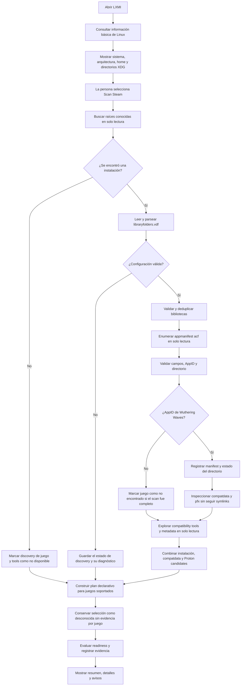
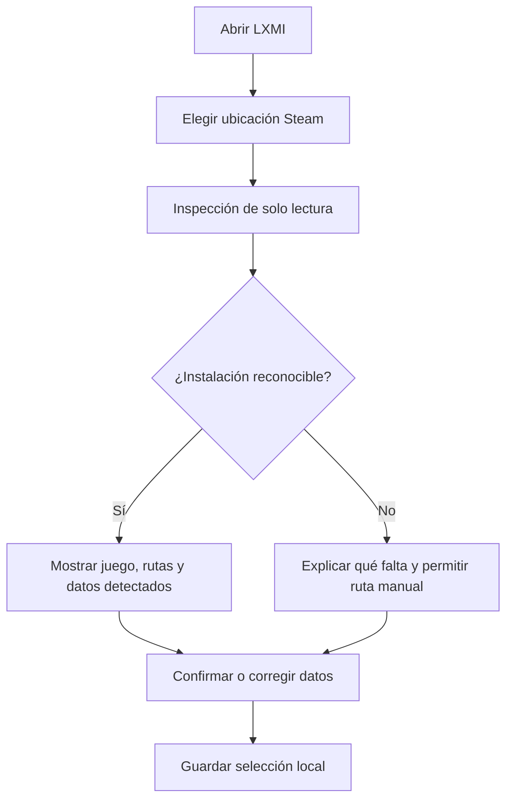
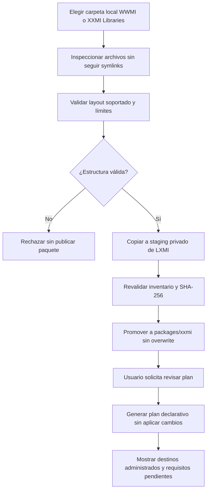
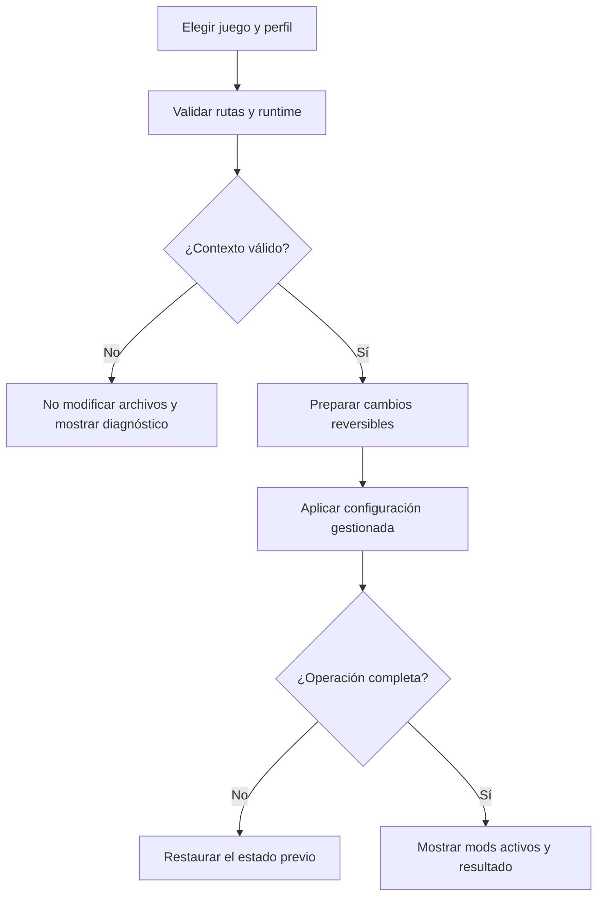

# Flujos de usuario propuestos

El primer diagrama corresponde al discovery y runtime planning de LXMI-0.1 a 0.4 implementados; pasó fixtures y se ejecutó contra Steam local en solo lectura. El flujo de importación de carpetas y revisión de plan corresponde al código de LXMI-0.5, aunque la interacción completa por IPC en ventana nativa queda NO COMPROBADA. No hay extracción de archives ni apply al juego. Los flujos de selección manual de instalación y activación de perfiles siguen siendo futuros.

## Flujo de LXMI-0.1 a 0.4: Steam, juegos, compatdata, tools y plan

## Inspeccionar y guardar una instalación (flujo futuro)

## Importar una carpeta runtime local y revisar plan (LXMI-0.5)

## Activar un perfil (flujo futuro)

