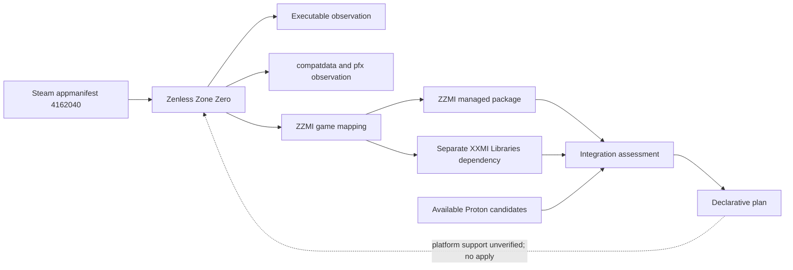
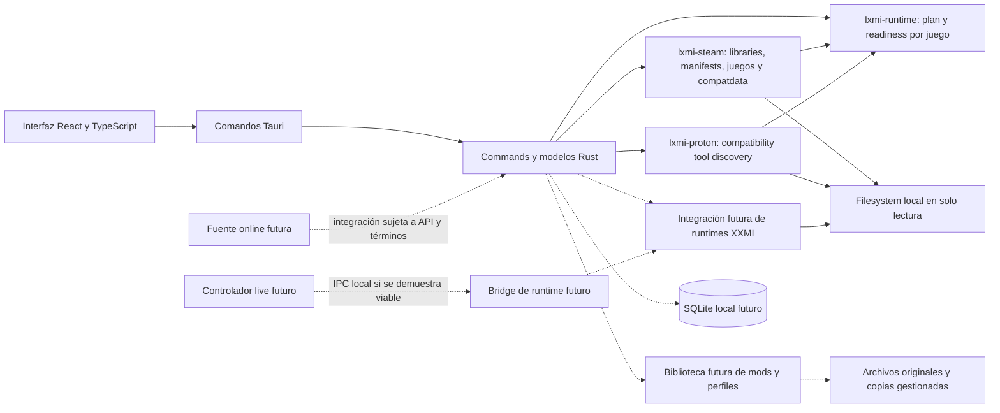
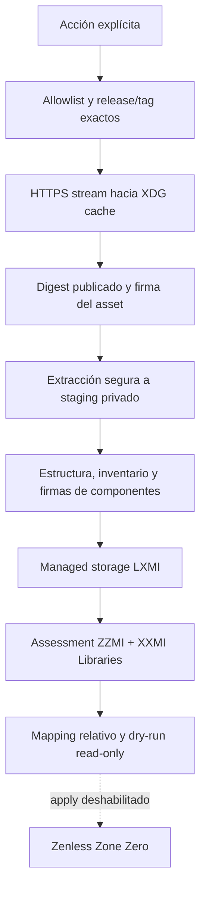

# Arquitectura conceptual

## Incremento LXMI-0.5: paquetes XXMI/WWMI

Esta vista amplía discovery/planning 0.1–0.4. `lxmi-xxmi` agrega detección estructural limitada, importación de directorio, storage administrado, assessment y plan. Importar persiste un paquete solo bajo XDG/LXMI; escaneos y planes siguen siendo efímeros. El plan no tiene executor y no escribe Steam/juego/prefix.

## Incremento LXMI-0.5.1: ZZZ y ZZMI

El catálogo relaciona `wuthering-waves` con WWMI y `zenless-zone-zero` con ZZMI. La detección actual de instalaciones está implementada para Steam mediante manifests; HoYoPlay/manual son valores del modelo, no scanners disponibles. La evaluación conserva por separado juego reconocido por ZZMI, distribución local, soporte Steam y compatibilidad Linux/Proton. Una detección estructural o un plan técnicamente construible no equivale a compatibilidad.



El layout ZZMI, el version source, ejecutable esperado y la dependencia XXMI Libraries se documentan en `01_Descubrimiento/ecosistema_xxmi_zzmi.md`. El contrato de LXMI es acotado y se debe revisar frente a una release concreta antes de importar payloads reales.

```mermaid
flowchart LR
    UI[React UI] --> IPC[Tauri commands]
    IPC --> APP[XXMI application service]
    APP --> CORE[lxmi-runtime plan and lxmi-core game]
    APP --> STEAM[lxmi-steam discovery]
    APP --> PROTON[lxmi-proton discovery]
    APP --> XXMI[lxmi-xxmi]
    SOURCE[Untrusted local directory] --> XXMI
    XXMI --> STAGE[Private XDG staging]
    STAGE --> STORE[Managed XXMI package storage]
    CORE --> PLAN[Reviewable declarative plan]
    STORE --> PLAN
    PLAN -. no apply in 0.5 .-> GAME[Game installation]
    PLAN -. no apply in 0.5 .-> PREFIX[Proton prefix]
```

XXMI Launcher gestiona importers; XXMI Libraries provee bibliotecas basadas en 3Dmigoto; WWMI y ZZMI son integraciones específicas por juego. La evidencia, versiones y revisión inicial de licencias están en `01_Descubrimiento/ecosistema_xxmi_wwmi.md` y `01_Descubrimiento/ecosistema_xxmi_zzmi.md`. `PackageAuthenticity::NotAuthenticated` es independiente de `LaunchCompatibility::NotVerified`; SHA-256 verifica la copia administrada contra su inventario, no el origen upstream ni compatibilidad de ejecución. El destino propuesto de los planes 0.5/0.5.1 sigue dentro del storage administrado, no en el juego.

Esta arquitectura adapta la propuesta del usuario. LXMI-0.1 a 0.4 implementan discovery y planificación con Tauri, React y crates Rust: información del sistema, Steam Libraries, manifests, catálogo de juegos, `compatdata/<AppID>/pfx`, compatibility tools y una evaluación declarativa por juego. LXMI 0.5 mantiene de solo lectura Steam/juego/prefix e incorpora una importación local explícita que escribe solo en almacenamiento XDG privado de LXMI. La planificación no ejecuta Steam, Proton, Wine ni el juego.



## Límites propuestos y actuales

- La UI no decide permisos ni ejecuta comandos de shell arbitrarios; expone operaciones tipadas y validadas.
- El core coordina casos de uso y delega filesystem, detección y lanzamiento en módulos pequeños.
- SQLite guarda metadatos y preferencias; los mods permanecen como archivos locales.
- Steam, juego, Proton y prefix se inspeccionan en modo de solo lectura. Solo el importador explícito escribe en el almacenamiento controlado de LXMI.
- No se modifica el motor gráfico ni se asume que exista un protocolo de recarga.
- Live Controller, bridge IPC y GameBanana son extensiones futuras, no dependencias del primer hito.

## Rebanada implementada en LXMI-0.1 a 0.5.1

| Capa | Responsabilidad en este incremento |
|---|---|
| UI React | Mostrar sistema, bibliotecas, juego, `compatdata`, tools, readiness y el panel XXMI de discovery/import/revisión de plan |
| Tauri Commands | Adaptar IPC a discovery, storage administrado e importación local explícita; no ejecuta contenido ni aplica planes |
| `lxmi-core` | Tipos del sistema, Steam, registro de Wuthering Waves/ZZZ, distribución/ejecutable y política declarativa de runtime |
| `lxmi-steam` | Resolver raíces/bibliotecas; parser KeyValues para VDF/ACF; manifests, juegos y compatdata/pfx |
| `lxmi-proton` | Reutilizar KeyValues; descubrir Steam/custom compatibility tools, validar metadata/rutas y clasificar Proton/Steam Linux Runtime |
| `lxmi-runtime` | Combinar observaciones de juego y tools; construir candidatos, requisitos, evidencia, issues y readiness efímeros |
| `lxmi-xxmi` | Validar paquetes locales, calcular SHA-256, importar de forma acotada a storage administrado, detectar runtime en rutas conocidas y producir assessment/plan declarativo |
| Filesystem | Discovery externo de solo lectura; importación aislada bajo el storage privado LXMI; tests con fixtures sintéticos |

El scanner parsea manifests válidos de bibliotecas descubiertas y filtra por el registro de juegos actual (Wuthering Waves y ZZZ). ZZZ se identifica por AppID `4162040`; el scanner deriva su directorio desde `installdir` y busca ejecutables conocidos con límites de profundidad/entradas. El AppID no implica una instalación completa ni compatibilidad con Proton. La inspección de `compatdata` no identifica la versión activa de Proton ni valida la salud del prefix.

Runtime discovery no equivale a runtime selection: las herramientas Proton encontradas son candidatos, y el plan mantiene la selección como desconocida sin evidencia fiable por juego, incluso si solo hay un candidato. Runtime selection tampoco equivale a lanzamiento. `compatdata` ausente se representa como `NotFound` y el prefix como `NotInitialized`; un `pfx` presente sigue siendo un candidato cuya salud no se valida. `RuntimeReadiness` evalúa únicamente la base observada para una preparación futura; `Ready` no significa que el juego se pueda lanzar ni que XXMI esté listo. No se implementan ejecutor de lanzamiento, modificación de Steam, SQLite, runtime XXMI ni biblioteca de mods.

La importación explícita es la única mutación de 0.5/0.5.1: opera bajo el root administrado por LXMI y no toca Steam, juego ni prefix. La estructura de paquete y SHA-256 no autentican firma ni origen. Los planes son efímeros y no hay operación `apply`.

Proton es parte de Platform Integration, no el dominio principal del producto. Los planes se generan bajo demanda y no se persisten. Los paquetes importados sí se conservan como archivos y metadata administrados, sin SQLite.

## Adaptabilidad

La detección debe describir explícitamente las ubicaciones y formatos soportados, permitir corrección manual y guardar versión/plataforma para diagnóstico. No se debe asumir un único layout de Steam ni de Proton sin evidencia.

## Incremento LXMI-0.5.2: releases oficiales y dry-run

`lxmi-xxmi` mantiene una frontera de red detrás de `ReleaseProvider`: el adaptador GitHub consulta únicamente los dos repositorios permitidos, resuelve el tag seleccionado y transmite assets a XDG cache con límites de redirect, tiempo y tamaño. Metadata de release, archivo cache y paquete administrado son objetos distintos. La consulta y descarga son acciones explícitas, no se hacen al abrir LXMI.

El ZIP se autentica contra la firma upstream antes de extraerse a staging privado. La extracción valida límites/rutas; después se valida el contrato del package, inventario y, para Libraries, firmas de DLL. El paquete se promueve al store LXMI sin modificar su payload. SHA-256 local y autenticidad de publisher permanecen separados de compatibilidad de plataforma.

El plan toma las rutas relativas del package y las reglas verificadas de XXMI Launcher. `importer_path` es configuración del launcher y no se conoce automáticamente; `configured_target_root` queda sin resolver. La carpeta del ejecutable ZZZ solo es un candidato de comparación para un dry-run de lectura. No se implementa apply ni se afirma compatibilidad Steam/Linux/Proton. Pins y evidencias: `../01_Descubrimiento/adquisicion_paquetes_xxmi_0_5_2.md`; ver ADR-024.


