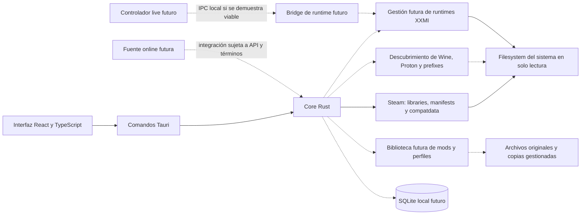

# Arquitectura conceptual

Esta arquitectura adapta la propuesta del usuario. LXMI-0.1/0.2 implementan una rebanada de descubrimiento con Tauri, React y crates Rust: información del sistema, Steam Libraries, manifests, el registro de juegos soportados y observación pasiva de `compatdata/<AppID>/pfx`. Las pruebas de crates y frontend están registradas en construcción; la aplicación nativa Tauri no se compiló en este entorno por bibliotecas del sistema ausentes. No se ha validado una instalación Steam real, ejecución con Proton ni acceso a runtimes. Las capas de Proton, runtime y mods siguen siendo futuras.

## Límites propuestos

- La UI no decide permisos ni ejecuta comandos de shell arbitrarios; expone operaciones tipadas y validadas.
- El core coordina casos de uso y delega filesystem, detección y lanzamiento en módulos pequeños.
- SQLite guarda metadatos y preferencias; los mods permanecen como archivos locales.
- El flujo inicial opera en modo de inspección de solo lectura.
- No se modifica el motor gráfico ni se asume que exista un protocolo de recarga.
- Live Controller, bridge IPC y GameBanana son extensiones futuras, no dependencias del primer hito.

## Rebanada implementada en LXMI-0.1/0.2

| Capa | Responsabilidad en este incremento |
|---|---|
| UI React | Mostrar estado del sistema, bibliotecas Steam, resultado de juegos compatibles y estados de `compatdata`/prefix candidato |
| Tauri Commands | Adaptar el IPC al resultado de descubrimiento; la compilación nativa queda pendiente por dependencias Linux ausentes |
| `lxmi-core` | Tipos de sistema/Steam, registro de juegos por AppID y modelos transitorios de instalación y compatdata |
| `lxmi-steam` | Resolver raíces y bibliotecas; reutilizar parser KeyValues para VDF/ACF; escanear manifests y consultar compatdata/pfx |
| Filesystem | Inspección de solo lectura de Steam y fixtures sintéticos aislados en tests |

El scanner parsea manifests válidos de las bibliotecas descubiertas, pero el resultado de producto solo incluye juegos reconocidos por el registro actual (Wuthering Waves). El AppID no implica que el juego esté instalado en el host Linux ni que sea compatible con Proton. La inspección de `compatdata` no identifica la versión activa de Proton ni valida el estado del prefix.

No se implementa todavía descubrimiento de versiones de Proton, configuración de lanzamiento, SQLite, gestión de runtime ni biblioteca de mods.

## Adaptabilidad

La detección debe describir explícitamente las ubicaciones y formatos soportados, permitir corrección manual y guardar versión/plataforma para diagnóstico. No se debe asumir un único layout de Steam ni de Proton sin evidencia.
