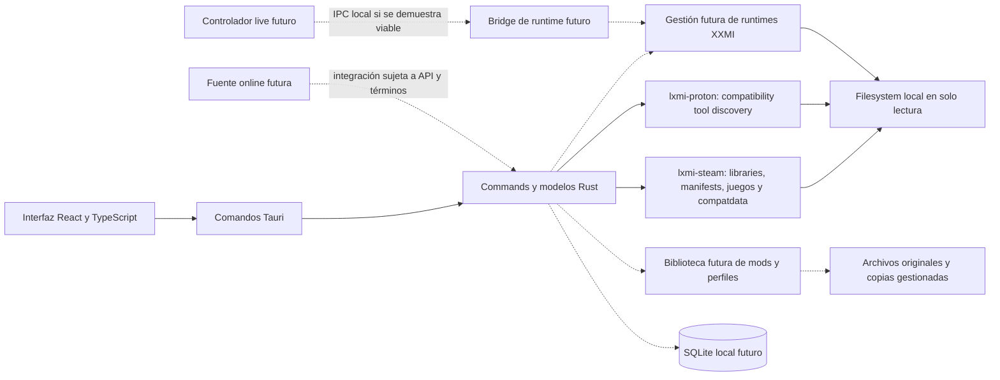

# Arquitectura conceptual

Esta arquitectura adapta la propuesta del usuario. LXMI-0.1/0.2/0.3 implementan discovery con Tauri, React y crates Rust: información del sistema, Steam Libraries, manifests, catálogo de juegos, `compatdata/<AppID>/pfx` y compatibility tools. `cargo check`, Clippy y tests del workspace, además de checks/build del frontend, pasaron. El scanner se ejecutó en solo lectura contra Steam local y la ventana Tauri se abrió con sus resultados visibles. No se validó ejecución ni compatibilidad con Proton o XXMI.

## Límites propuestos

- La UI no decide permisos ni ejecuta comandos de shell arbitrarios; expone operaciones tipadas y validadas.
- El core coordina casos de uso y delega filesystem, detección y lanzamiento en módulos pequeños.
- SQLite guarda metadatos y preferencias; los mods permanecen como archivos locales.
- El flujo inicial opera en modo de inspección de solo lectura.
- No se modifica el motor gráfico ni se asume que exista un protocolo de recarga.
- Live Controller, bridge IPC y GameBanana son extensiones futuras, no dependencias del primer hito.

## Rebanada implementada en LXMI-0.1/0.2/0.3

| Capa | Responsabilidad en este incremento |
|---|---|
| UI React | Mostrar sistema, bibliotecas, juego y `compatdata`, herramientas Proton/compatibilidad, versión, metadata, source y estado |
| Tauri Commands | Adaptar el IPC a la orquestación de `lxmi-steam` y `lxmi-proton`; compilación y arranque comprobados |
| `lxmi-core` | Tipos de sistema/Steam, registro de juegos por AppID y modelos transitorios de instalación y compatdata |
| `lxmi-steam` | Resolver raíces/bibliotecas; parser KeyValues para VDF/ACF; manifests, juegos y compatdata/pfx |
| `lxmi-proton` | Reutilizar KeyValues; descubrir Steam/custom compatibility tools, validar metadata/rutas y clasificar Proton/Steam Linux Runtime |
| Filesystem | Inspección limitada de solo lectura; tests con fixtures sintéticos aislados |

El scanner parsea manifests válidos de las bibliotecas descubiertas, pero el resultado de producto solo incluye juegos reconocidos por el registro actual (Wuthering Waves). El AppID no implica que el juego esté instalado en el host Linux ni que sea compatible con Proton. La inspección de `compatdata` no identifica la versión activa de Proton ni valida el estado del prefix.

Proton discovery no determina qué herramienta selecciona Steam para Wuthering Waves. `compatdata` ausente es válido, y `pfx` solo es un candidato. No se implementan selección de runtime, configuración o ejecución de lanzamiento, SQLite, gestión de runtime XXMI ni biblioteca de mods.

## Adaptabilidad

La detección debe describir explícitamente las ubicaciones y formatos soportados, permitir corrección manual y guardar versión/plataforma para diagnóstico. No se debe asumir un único layout de Steam ni de Proton sin evidencia.
